# CitibankProcessor

### Purpose

​	This project was intended to assist with organizing and labeling bank statements transactions specifically from Citibank. From my understanding, there are different methods to organize and visualize the transactions that occur on cards. Being able to track, personalize, and utilize a tool to do this would be what I would like to get out of this project. Initially I thought it would be great tool for some people I know who use excel to look at data. Somewhere along the way, this could be handy for me as well. That I know that goes through the bank statements, and thus this project is meant make the task of reading the purchases of a bank statement from Citibank, and making labeling the purpose of each purchase much faster and easier. It can be modified easily to adjust to certain statement or outputs. It is also meant to be modified for later use in order to make going through future bank statements faster.


### Implementation

​	The way that I approached this project was trying to implement specific aspects to different python files. In other words I just started coding. Due to this, the class cohesion isn't as strong as it can be. The project's coupling theme would be a form of sequential coupling where most classes are. Reviewing the project once more has allowed me to appreciate the art of planning out classes.


### Building Application

This program was made using python. For both systems it is required that you have the latest version of python and the python environment variable is set up. If you are having any trouble getting this program please don’t be afraid to make a ticket on this project.

##### > Windows

For windows all you have to do is start the program `start.bat` which download the libraries, and will start up the necessary python file.

##### > Linux

For Linux in a bash window please enter the following commands in the directory:

````
sudo apt-get install python3-tk
./linuxStart.sh
````


### Features

* Transforms a CSV file download of a monthly Citi Bank statement into an excel spreadsheet
* Provides an easy and fast way to label and comment on transactions
* Labels different expenses to different categories
* Automatically labels categories with keywords


### Pictures


> This is a sample input that is determined by Citi Bank, it contains all transactions within a group of accounts


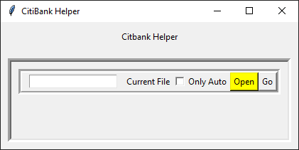

> Initial window that prompts a user to open a file


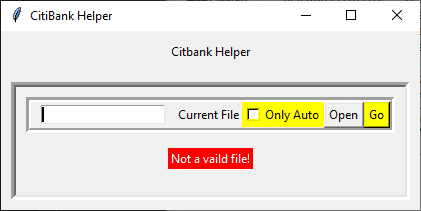

> Error message when a file is not valid


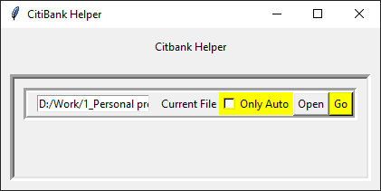

> Prompts the user to go to next window and to check or uncheck the “Only Auto” option. This option skips all of the items that are not automatic and only categorize all the transactions that can be categorized.


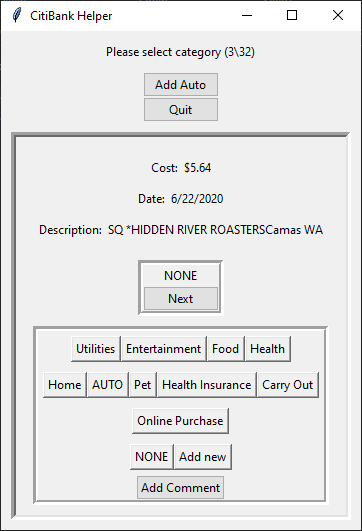

> The second window. This is an example of a transaction. It gives information on the transaction including the cost, date and the description. This allows a user to view what the purchase is to determine what category it belongs to and leaves an option to leave a comment.


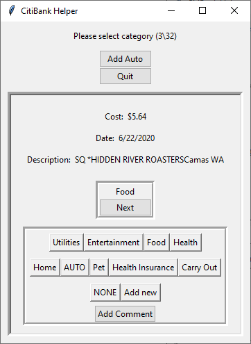

> Here the “Food” label was chosen and the transaction is now labeled “Food”, the user is now able to move to the next transaction with the next button.


> The user is able to leave a comment to each transaction by clicking the “Add Comment”


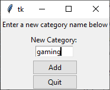

> There is also an option to add a category which will be added to the list of buttons on the transaction window


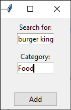

> By clicking the “Add Auto” button you could can set auto categorizing phrases. The program will search for the keyword in the transaction description and then will put all transactions with that keyword into the specified category. When this happens, a transaction window is not pulled up for those transactions.


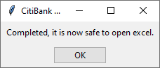

> Once all the transactions have been gone through, then the excel spreadsheet is ready to be opened


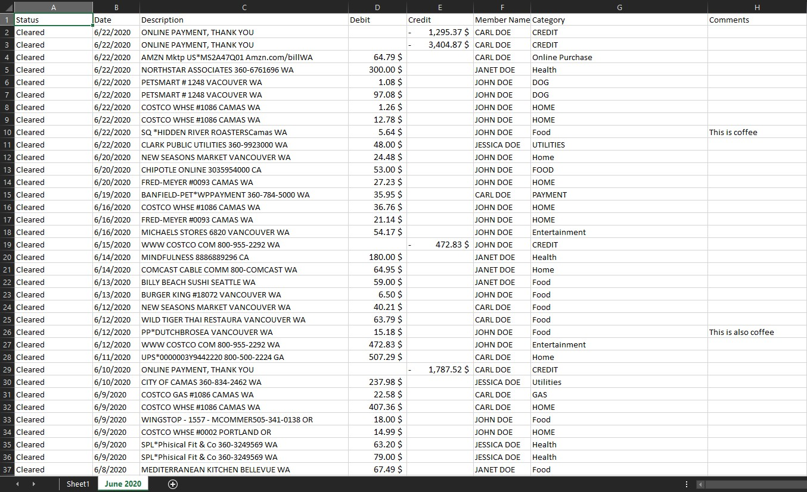

> This is the final product where there exist a new spreadsheet with the correct month and year. There are two new columns that contain the category name, and the comments that were left for each transaction.


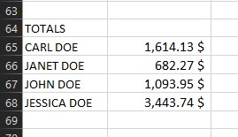

> The final excel spreadsheet will also create a table at the end of the spreadsheet telling the totals for each person in that month.


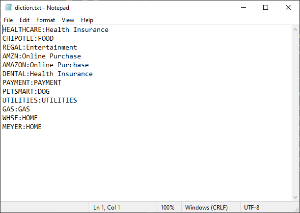

> This is an example of how keywords are stored to automatically categorize transactions


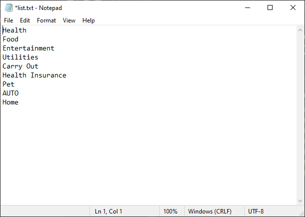

> This is the file where all the User created categories are stored

### Current TODO

* Variable path for **start.bat**
* Boot files more traditionally using an **\_\_init\__.py** file
* Check for stability
* Cleaner and more concise code
* Update number of entries after making a new automation
* Ensure the state of the excel spreadsheet is always safe
* Create a settings page to do the following:
  - Update keywords
  - Update Automatic labels
* Create Highlighted cells for keywords
* big TODO... is redesigning


### Final Notes

As a disclaimer, I intended this project to be more so a proof of concept of personal growth and achievement. I would be delighted to hear any feedback if you have a moment: robertoepalma@gmail.com.

